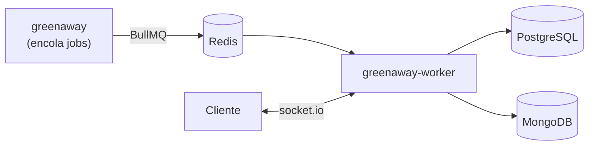

# ⚙️ greenaway-worker

Proceso persistente de **Greenaway** (repo principal: `greenaway`) — hace todo lo que la app
Next.js (serverless) no puede sostener por sí misma:

- **Consumers de BullMQ** — envían los emails de reserva y arman las notificaciones in-app, de forma
  asíncrona (la app encola; este proceso ejecuta).
- **Servidor socket.io** — el chat host↔guest en vivo, con su Redis adapter para el fan-out entre
  instancias.

## Por qué es un repo aparte

Las dos cosas necesitan un **proceso siempre encendido**: socket.io sostiene conexiones abiertas y los
consumers de BullMQ son loops de vida larga. Eso descarta un runtime serverless (que se muere entre
requests), y es exactamente lo que justifica separar este proceso de la app.

## Arquitectura



- **Consume** de las colas `emails` y `notifications` en Redis; **no** encola nada (eso lo hace la app).
- **Sirve** el chat por socket.io: handshake autenticado por token; al unirse a un room verifica en
  PostgreSQL y MongoDB que el usuario sea el guest o el host de esa reserva.
- **Lee** PostgreSQL y MongoDB para rehidratar datos de notificaciones y persistir mensajes.

El *por qué* del transporte realtime está en
`greenaway/docs/architecture/REAL_TIME_TRANSPORT_AND_FAN_OUT.md`.

## Contratos espejo — ojo acá

Los dos repos se hablan **solo por contratos replicados a mano** (no hay paquete compartido). La fuente
de verdad es el repo de la app; este repo mantiene copias:

- **Fila de outbox**: la app la escribe (`OutboxEventType` en `greenaway/lib/outbox/types.ts`) y el
  relay de acá la convierte en jobs. Los payloads de BullMQ (`src/events.ts`) viven solo en este repo.
  La regla completa está en [`BULLMQ_QUEUES.md`](./docs/architecture/BULLMQ_QUEUES.md) (copia idéntica en ambos repos).
- **Contrato de chat** (`src/chat/types.ts`: `EVENTS`, `ClientMessage`, `MessageAck`) ← espejo de
  `greenaway/lib/chat/socket.ts`.

Si cambia un contrato en la app, el espejo de acá se actualiza **en el mismo cambio**.

## Estructura

```
src/index.ts     Bootstrap: arranca los workers de BullMQ + el servidor socket.io; graceful shutdown
src/processors/  Handlers de jobs (email, notificaciones) + el dispatcher por processorKey
src/chat/        Auth del handshake, autorización del room (membresía en la reserva) y el flujo de mensajes
src/redis/       Clientes de Redis: workers de BullMQ, pub client y el server socket.io (+ adapter)
src/mongo/ · src/pg/   Acceso a datos (listados, chats, mensajes, notificaciones · usuarios, reservas)
```

## Cómo correrlo

Requiere Redis (colas + adapter), MongoDB y PostgreSQL accesibles.

```bash
npm install
cp .env.example .env      # REDIS_URL · JWT_SECRET · RESEND_API_KEY · Mongo/PG · SOCKET_PORT · CLIENT_ORIGIN
docker compose up -d      # Redis local (opcional)
npm run dev
```

`JWT_SECRET` tiene que ser **el mismo** que el de la app: este proceso verifica los tokens que ella
firma.

## Comandos

| | |
|---|---|
| `npm run dev` | watch con `tsx` |
| `npm run build` · `npm start` | compila a `dist/` · corre lo compilado |
| `npm test` · `npm run test:watch` | tests (Vitest) |

## Backlog y decisiones

Los ADRs y la deuda técnica viven en el repo de la app (`greenaway/docs/`).
