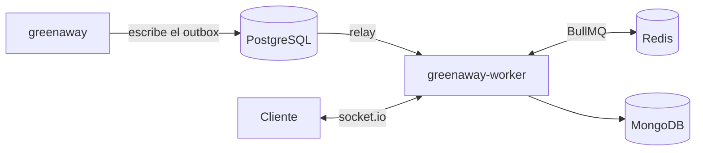

# ⚙️ greenaway-worker

Proceso persistente de **Greenaway** (repo principal: `greenaway`) — hace todo lo que la app
Next.js no puede sostener por sí misma:

- **Relay del outbox + consumers de BullMQ** — publica en las colas lo que la app registró en el
  outbox, y los consumers envían los emails de reserva y arman las notificaciones in-app.
- **Servidor socket.io** — el chat host↔guest en vivo, con su Redis adapter para el fan-out entre
  instancias.

## Por qué es un repo aparte

Las dos cosas necesitan un **proceso siempre encendido**: socket.io sostiene conexiones abiertas y los
consumers de BullMQ son loops de vida larga. Eso descarta un runtime serverless (que se muere entre
requests), y es exactamente lo que justifica separar este proceso de la app.

## Arquitectura



- **Publica y consume** las colas `emails` y `notifications`: el relay lee las filas pendientes del
  outbox que escribe la app, las encola en BullMQ y los workers las procesan.
- **Sirve** el chat por socket.io: handshake autenticado por token; al unirse a un room verifica en
  PostgreSQL y MongoDB que el usuario sea el guest o el host de esa reserva.
- **Lee** PostgreSQL y MongoDB para rehidratar datos de notificaciones y persistir mensajes.

## Contratos espejo — ojo acá

Los dos repos se hablan **solo por contratos replicados a mano** (no hay paquete compartido). La fuente
de verdad es el repo de la app; este repo mantiene copias:

- **Fila de outbox**: la app la escribe (`OutboxEventType` en `greenaway/lib/outbox/types.ts`) y el
  relay de acá la convierte en jobs. Los payloads de BullMQ (`src/events.ts`) viven solo en este repo.
  La regla completa está en [`bullmq-queues.md`](./docs/architecture/bullmq-queues.md).
- **Contrato de chat** (`src/chat/types.ts`: `EVENTS`, `ClientMessage`, `MessageAck`) ← espejo de
  `greenaway/lib/chat/socket.ts`.

Si cambia un contrato en la app, el espejo de acá se actualiza **en el mismo cambio**.

## Estructura

```
src/index.ts           Bootstrap: arranca el relay, los workers de BullMQ y el servidor socket.io; graceful shutdown
src/relay.ts           Polling del outbox → encola los jobs → marca la fila como publicada
src/outbox/            Qué jobs dispara cada fila del outbox (fan-out)
src/events.ts          Contratos de los jobs de cada cola
src/processors/        El índice de cada cola: processorKey → handler
src/emails/            Un archivo por mail (copy + template + handler) y el envío por Resend
src/notifications/     Notificaciones in-app: documento en Mongo + publish al canal SSE
src/chat/              Auth del handshake y autorización del room (membresía en la reserva)
src/redis/             Queues, workers de BullMQ, pub client y el server socket.io (+ adapter)
src/mongo/ · src/pg/   Acceso a datos (listados, chats, mensajes, notificaciones · usuarios, reservas, outbox)
```

## Cómo correrlo

Requiere Redis (colas + adapter), MongoDB y PostgreSQL. Los levanta el repo `greenaway` con
`pnpm infra:up` (Docker, con schema y seed); este proceso se conecta a esos mismos contenedores.

```bash
npm install
cp .env.example .env      # REDIS_URL · JWT_SECRET · RESEND_API_KEY · Mongo/PG · SOCKET_PORT · CLIENT_ORIGIN
npm run dev
```

`JWT_SECRET` tiene que ser **el mismo** que el de la app: este proceso verifica los tokens que ella
firma.

## Comandos

| | |
|---|---|
| `npm run dev` | watch con `tsx` |
| `npm run build` · `npm start` | compila a `dist/` · corre lo compilado |

## Limitaciones conocidas

- Sin linter ni tests: las piezas puras (`toJobs`, `buildNotification`, los templates) están escritas
  para testearse sin Redis ni DB, pero todavía no tienen tests.
- Las del sistema completo están en el README de `greenaway`.
