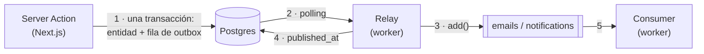

# Colas (BullMQ + Redis)

Cómo está cableado el trabajo asíncrono y cómo agregar un job nuevo. Los criterios generales
(garantías, reintentos, idempotencia) están en `greenaway/.claude/rules/05-async.md`.

## Panorama

- La **app** nunca toca Redis en el path de escritura: escribe la entidad y su fila de `outbox` en la
  misma transacción. Si Redis está caído, la reserva igual queda con su efecto pendiente.
- El **relay** (`src/relay.ts`) lee las filas sin publicar, las traduce a jobs
  (`src/outbox/fan-out.ts`), las encola y recién después marca `published_at`. No espera al consumer.
- El **consumer** (`src/processors/*`) ejecuta el trabajo. Los payloads (`src/events.ts`) viven solo
  en este repo.

## Reglas del payload

- **Fila de outbox: thin.** Solo ids; el payload rico se arma en el relay al publicar.
- **Job: mínimo y JSON-safe.** Solo lo que el consumer usa, sin secretos, fechas como ISO string.
- **Autodescriptivo.** Lleva `processorKey` (literal) y `eventId` (el id de la fila de outbox).

## Convenciones

- **Una cola = una familia de trabajo** (`emails`, `notifications`), no un job puntual. El nombre es
  idéntico en `new Queue` (`src/redis/queues.ts`) y `new Worker` (`src/redis/workers.ts`).
- **`processorKey` rutea dentro de la cola.** Los jobs de una cola forman una unión discriminada
  (`EmailJob`, `NotificationJob`); el `switch` del processor narrowea y el `default` asigna a
  `never`, así que un job sin su `case` no compila. Variaciones del mismo trabajo (los mails
  `pending`/`approved`/…) son un campo `type`, no un `processorKey` nuevo.
- **Conexión:** los workers leen `REDIS_URL`; las queues, `REDIS_HOST`/`PORT`/`USER`/`PASSWORD`
  (`getRedisConnectionParams`).

## Idempotencia

BullMQ es *at-least-once* y el relay puede republicar una fila si muere entre el `add()` y la marca.
Se cubre en dos lugares:

| Dónde | Cómo | Ref |
|---|---|---|
| Productor | `jobId` determinístico con la etapa: `booking-{id}-{tipo}`. Un `add()` repetido se ignora mientras el job siga retenido | `src/outbox/fan-out.ts` |
| Consumer, mail | Clave de idempotencia de Resend: `notify-booking/{eventId}`. Resend descarta el envío repetido por 24 h | `src/emails/booking.ts` |
| Consumer, notificación | Índice único sobre `notifications.event_id`: el insert es el chequeo | `src/mongo/notifications.mongo.ts` |

## Agregar un job

**En la app:**
1. El `OutboxEventType` en `lib/outbox/types.ts`.
2. La fila en la misma transacción que la entidad, con `insertOutboxEvent` (modelo:
   `insertBooking` / `updateBooking`).

**En el worker:**
1. El `XxxPayload` en `src/events.ts`, con `processorKey` literal y `Claimable`, sumado a la unión
   de su cola.
2. El evento en el resolver de su agregado (`getUserJob` / `getBookingJob` en
   `src/outbox/fan-out.ts`), con su `jobId` determinístico. Si el agregado no está, `null`.
3. Un archivo `src/<cola>/<evento>.ts` con copy, template y handler. El handler es idempotente
   (tabla de arriba) y deja propagar el error para que BullMQ reintente.
4. Su `case` en `src/processors/<cola>.ts`.
5. Si es una cola nueva: `src/redis/queues.ts`, `src/redis/workers.ts`, el map `queues` del relay
   y el bootstrap de `src/index.ts`.
6. `npm run build` verde.
